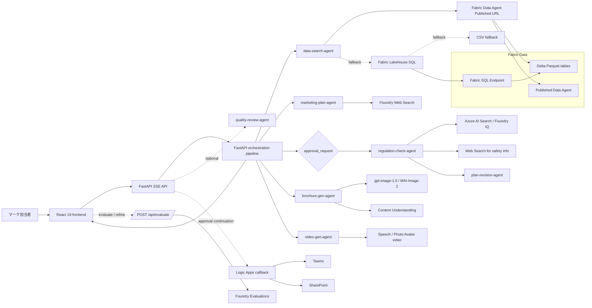
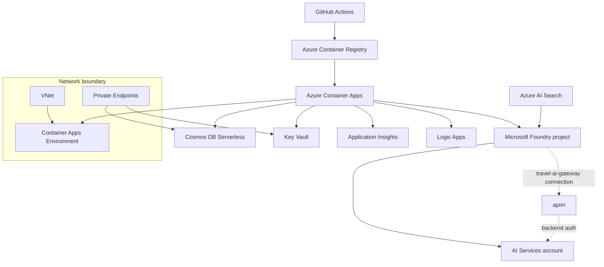

# Azure アーキテクチャ

このドキュメントは、要件書の理想構成ではなく、現在の実装と Azure 側の実配備前提をベースに整理したものです。詳細な構成図は [architecture.drawio](architecture.drawio) も参照してください。

## 1. ランタイム実行フロー

## 2. Azure リソース構成

## 3. IaC で作られるもの

| リソース | 構成 |
|---|---|
| AI Services | `kind=AIServices`、`allowProjectManagement=true`、`disableLocalAuth=true`、`gpt-5-4-mini` を既定で配備 |
| Foundry project | `accounts/projects@2025-06-01` |
| Container Apps | System-assigned MI、`/api/health` と `/api/ready` の probe、0-3 レプリカ |
| APIM | BasicV2、Managed Identity。`scripts/postprovision.py` で Foundry AI Gateway 接続とトークン制限・メトリクスのポリシーを適用 |
| Logic Apps | Consumption、HTTP trigger ベース |
| Cosmos DB | Serverless、`disableLocalAuth=true`、Private Endpoint、RBAC |
| Key Vault | Private Endpoint、RBAC |
| Observability | Log Analytics + Application Insights |

## 4. IaC の後に手動で補う項目

| 項目 | 理由 |
|---|---|
| Azure AI Search の作成と `regulations-index` の投入 | Foundry IQ の実データ検索に必要 |
| Foundry project と Azure AI Search の接続 | `search_knowledge_base()` の既定接続に必要 |
| `FABRIC_DATA_AGENT_URL` | Agent1 が Fabric Data Agent Published URL を優先利用するため |
| `FABRIC_SQL_ENDPOINT` | Agent1 の Fabric Lakehouse SQL フォールバック接続に必要（未設定時は CSV フォールバック） |
| `EVAL_MODEL_DEPLOYMENT` | `/api/evaluate` に評価専用 deployment を使う場合 |
| `CONTENT_UNDERSTANDING_ENDPOINT` | PDF 解析ツールが参照 |
| `SPEECH_SERVICE_ENDPOINT` / `SPEECH_SERVICE_REGION` | Photo Avatar 動画生成ツールが参照（HD voice + SSML ナレーション、`casual-sitting` スタイル） |
| `VOICE_SPA_CLIENT_ID` / `AZURE_TENANT_ID` | Voice Live の MSAL.js 認証（Entra アプリ登録が必要） |
| `LOGIC_APP_CALLBACK_URL` | 承認継続後の HTTP callback に必要 |

## 5. 認証モデル

| 実行主体 | 認証方式 | 主な用途 |
|---|---|---|
| FastAPI / Container App | `DefaultAzureCredential` | Foundry、Fabric Data Agent / Fabric SQL、Cosmos DB、Azure AI Search |
| APIM | Managed Identity | Foundry バックエンドへの認証 |
| AI Search bootstrap script | Foundry 接続または API key | 初期インデックス投入 |

Container App の Managed Identity には、Bicep で Foundry 関連ロール、Cosmos DB Data Contributor、Key Vault Secrets User、AcrPull が割り当てられます。

## 6. 現在の実装メモ

- `POST /api/chat` の Azure モードは、FastAPI 内で Agent1 → Agent2 を実行後に `approval_request` を返し、承認後に Agent3a → Agent3b → Agent4 → Agent5 を続行します。
- Agent1 は `FABRIC_DATA_AGENT_URL` がある場合、Fabric Data Agent Published URL を最優先で使用します。利用不可時のみ Fabric Lakehouse SQL endpoint の pyodbc 接続、その後 CSV → ハードコードデータへフォールバックします。
- Agent4 は顧客向けブローシャを生成し、KPI・売上目標・社内分析を含めません。
- Agent5（動画生成）は Photo Avatar で SSML ナレーションを生成し、`ja-JP-Nanami:DragonHDLatestNeural` 音声、冒頭ジェスチャー、`casual-sitting` スタイルの販促動画を MP4/H.264 で生成します。
- Agent6 は `GitHubCopilotAgent` + `PermissionHandler.approve_all` で動作し、利用不可時は `FoundryChatClient` にフォールバックします。
- Code Interpreter はランタイムで自動検出され、利用不可時はグレースフルにフォールバックします。
- APIM は Azure 側に作られ、`scripts/postprovision.py` で Foundry AI Gateway 接続（`travel-ai-gateway`）の作成とトークン制限ポリシー（80,000 tokens/min）の適用が自動実行されます。加えて Voice Live 用 Prompt Agent と Entra SPA アプリ登録も作成します。
- `/api/evaluate` は Built-in 評価器（Relevance / Coherence / Fluency）に加え、旅行業法準拠、コンバージョン期待度、訴求力、差別化、KPI 妥当性、ブランドトーンを返し、成功時は Foundry にログします。
- フロントエンドは各 `done` イベントごとに成果物スナップショットを保持し、`VersionSelector` で企画書・ブローシャ・画像・動画をまとめて切り替えます。
- 新しい版の生成中は、右ペインはそのラウンドのライブワークスペースとして更新されます。同時に `VersionSelector` から確定済みバージョンを読み取り専用で確認でき、生成中チップでライブ表示に戻せます。
- 評価比較 UI はフロントエンド内で完結し、現在の版と比較対象版を上部カードで併記します。比較対象を変えてもメインの成果物プレビューは切り替わりません。
- 評価レスポンスに `task_adherence` が含まれる場合でも、現行 UI ではノイズ低減のため比較差分、総合サマリ、改善フィードバックから除外しています。
- 品質レビューは主フロー後の追加 `text` イベントとして返ります。主 orchestration step ではありません。
- パイプラインは 5 ユーザー向けステップで、内部は 7 エージェントで構成されています（Agent3a+3b がステップ 4、Agent4+5 がステップ 5 を共有）。
- モデル配備側のガードレールを主軸にしつつ、FastAPI 側では明らかな入力 / ツール応答の指示上書きだけを軽量ガードでブロックします。Prompt Shields や tool-response 介入などの追加 guardrail は Azure / Foundry 側で明示設定した場合のみ有効です。
- Azure AI Search の実行時検索は Managed Identity ベースです。API キーはセットアップ用スクリプトの任意経路にだけ残っています。
- Voice Live API は MSAL.js + Entra アプリ登録認証で動作し、`/api/voice-token` と `/api/voice-config` エンドポイントを提供します。
- 会話履歴は Cosmos DB に保存され、フロントエンドの `restoreConversation()` で再推論なしに復元されます。
